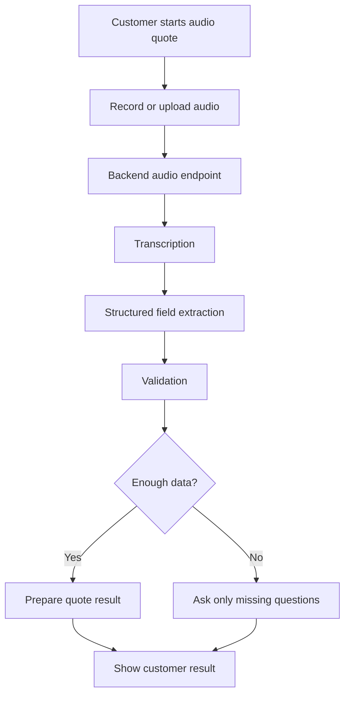

# Audio Quote Implementation Plan

This plan turns the audio quote blueprint into an executable implementation path for the PIETY site/app.

## Current Product Problem
The customer expects to click audio quotation, speak, and receive a quote. The current behavior is not enough when it only shows recorder errors, opens camera/video by mistake, asks for manual upload without a clear result, or sends the customer to WhatsApp.

The correct outcome is an automated quote flow inside the site.

## Target Architecture



## Implementation Steps

### 1. Frontend Capture UX
Owner agents: `frontend-developer`, `voice-ai-integration-engineer`, `product-manager`

Build a simple audio card with:
- Primary button: `Cotar falando agora`.
- Recording state: timer, `Parar`, `Cancelar`.
- Processing state: `Analisando seu audio...`.
- Fallback button: `Usar audio gravado no aparelho`.
- Clear success state after fields are extracted.
- Missing-data prompt when needed.

Important mobile rule:
- The customer must not be pushed into video recording when the intent is audio.
- If browser recording fails, the fallback file picker must continue the same AI quote pipeline.

### 2. Backend Audio Endpoint
Owner agents: `backend-architect`, `voice-ai-integration-engineer`, `api-tester`

Create an endpoint similar to:

`POST /api/audio-quote`

Input:
- `multipart/form-data`
- `audio`: audio blob/file
- `source`: `browser-recorder`, `file-picker`, or `recorder-page`
- optional existing form/session state

Output:
- `status`: `completed`, `needs_more_info`, or `failed`
- `transcript`
- `extracted_fields`
- `missing_fields`
- `quote_summary` or `quote_payload`
- `user_message`
- `debug_id`

### 3. Audio Normalization
Owner agents: `backend-architect`, `voice-ai-integration-engineer`

Accept common mobile formats:
- `.m4a`
- `.aac`
- `.mp3`
- `.wav`
- `.webm`
- `.ogg`

If transcription provider has codec limits, normalize server-side before transcription.

### 4. Transcription
Owner agents: `voice-ai-integration-engineer`, `ai-engineer`

Use the configured transcription provider from environment variables.

Rules:
- No API keys in source control.
- Timeout and retry must be explicit.
- Store or log only what is necessary and safe.
- Return a support-safe `debug_id` for failures.

### 5. Structured Extraction
Owner agents: `ai-engineer`, `piety-health-specialist-br`

Return schema:

```json
{
  "city": null,
  "state": null,
  "modality": null,
  "company_type": null,
  "lives_count": null,
  "ages": [],
  "has_cnpj": null,
  "current_plan": null,
  "desired_coverage": null,
  "contact_name": null,
  "phone": null,
  "missing_fields": [],
  "confidence": 0,
  "transcript": ""
}
```

Do not let AI invent quote prices, plan rules, operator eligibility, or unavailable products.

### 6. Validation and Recovery
Owner agents: `product-manager`, `workflow-architect`, `frontend-developer`

If required fields are missing, ask only for missing details. Examples:
- `Qual cidade e UF?`
- `Quantas vidas entram no plano?`
- `Quais as idades?`
- `A cotacao e para pessoa fisica, PME ou adesao?`

The customer must not restart the full form after speaking.

### 7. Quote Result
Owner agents: `piety-health-specialist-br`, `backend-architect`, `frontend-developer`

Depending on available integrations, result may be:
- Live quote from connected data/API.
- Standard quote summary ready for follow-up.
- Best available plans from current database.
- Clear message that a consultant will finalize when external pricing is unavailable.

But the site must show the structured result and next step.

## Acceptance Criteria
The feature is not complete until these cases pass:

| Case | Expected Result |
|---|---|
| Desktop Chrome recording | Audio reaches backend, fields extracted, quote result or missing-data prompt shown. |
| Android Chrome recording | Same result as desktop. |
| iPhone Safari primary path | Either inline recording works or fallback audio picker reaches the same pipeline. |
| Microphone denied | User gets a fast recovery path without losing progress. |
| Browser recording unsupported | User can select an audio file and continue. |
| Low-quality audio | System asks for clarification or missing fields. |
| Missing information | Site asks only the missing questions. |
| Backend/transcription failure | User receives helpful retry message plus support-safe debug id. |

## What Cannot Count as DONE
- A button was added.
- The recorder UI appears but does not produce a quote.
- Audio is sent to WhatsApp.
- Transcription works but does not fill or prepare the quote.
- The feature works only on one desktop browser.
- A deployment happened without end-to-end evidence.

## Execution Order
1. Implement backend endpoint and schema.
2. Implement frontend upload/recording UI connected to endpoint.
3. Implement transcription and extraction.
4. Implement validation and missing-data prompts.
5. Connect quote result or quote summary display.
6. Test the acceptance criteria.
7. Reality Checker reviews evidence before DONE.
